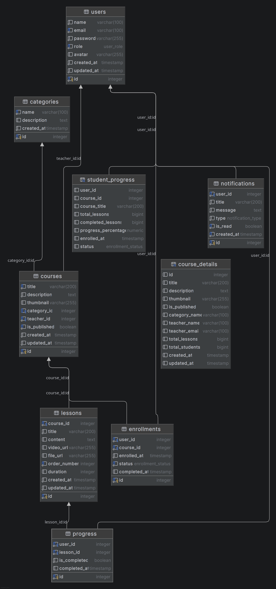

# E-Learning Platform

Platform pembelajaran online berbasis web yang dibangun dengan arsitektur microservices menggunakan Go, gRPC, dan React.

## Daftar Isi

- [Tentang Proyek](#tentang-proyek)
- [Tech Stack](#tech-stack)
- [Fitur Utama](#fitur-utama)
- [Arsitektur Sistem](#arsitektur-sistem)
- [Skema Database](#skema-database)
- [Prerequisites](#prerequisites)
- [Instalasi](#instalasi)
- [Konfigurasi](#konfigurasi)
- [Menjalankan Aplikasi](#menjalankan-aplikasi)
- [Struktur Proyek](#struktur-proyek)
- [API Documentation](#api-documentation)

## Tentang Proyek

E-Learning Platform adalah sistem manajemen pembelajaran yang dirancang untuk memfasilitasi interaksi antara guru dan siswa dalam lingkungan digital. Platform ini mendukung berbagai role pengguna (Admin, Guru, Siswa) dengan fitur-fitur lengkap untuk pengelolaan kursus, materi pembelajaran, progress tracking, dan sistem notifikasi real-time.

Proyek ini dikembangkan sebagai bagian dari Uji Kompetensi Keahlian (UKK) jurusan Rekayasa Perangkat Lunak.

## Tech Stack

### Backend

| Teknologi | Deskripsi |
|-----------|-----------|
|  | Bahasa pemrograman utama backend |
|  | HTTP web framework |
|  | Remote procedure call framework |
|  | Serialisasi data |
|  | Database relational |
|  | Authentication & Authorization |
|  | Structured logging |
|  | Log rotation |

### Frontend

| Teknologi | Deskripsi |
|-----------|-----------|
|  | Library JavaScript untuk UI |
|  | Superset JavaScript dengan typing |
|  | Build tool & dev server |
|  | Component library |
|  | Utility-first CSS framework |
|  | Client-side routing |
|  | HTTP client |

### DevOps & Tools

| Teknologi | Deskripsi |
|-----------|-----------|
|  | Containerization |
|  | Container engine (alternatif Docker) |
|  | Multi-container orchestration |
|  | Version control |

## It works on my machine
versi tools yang saya pake:
- `go version go1.25.4 X:nodwarf5 linux/amd64`
- Bun `1.3.3`
- `podman-compose version 1.5.0`
- `podman version 5.7.0`
- `postgres (PostgreSQL) 18.1`
- `Linux 6.17.9-arch1-1 #1 SMP PREEMPT_DYNAMIC Mon, 24 Nov 2025 15:21:09 +0000 x86_64 GNU/Linux`

## Fitur Utama

### Role Admin
- Manajemen pengguna (CRUD guru dan siswa)
- Manajemen kursus (approval, monitoring)
- Sistem notifikasi broadcast
- Dashboard analytics dan reporting
- Monitoring aktivitas sistem

### Role Guru
- Membuat dan mengelola kursus
- Upload materi pembelajaran (PDF, video)
- Manajemen lesson dan chapter
- Monitoring progress siswa
- Memberikan feedback dan penilaian

### Role Siswa
- Browse dan enroll kursus
- Akses materi pembelajaran
- Progress tracking otomatis
- Dashboard personal
- Notifikasi real-time

### Fitur Umum
- Authentication & Authorization dengan JWT
- Upload file dengan validasi (PDF, video)
- Dark mode / Light mode
- Responsive design
- Real-time notification via gRPC
- Log rotation dan monitoring
- RESTful API

# Kenapa Menggunakan Go?
singkatnya: pengen nyoba aja sih.
lengkapnya: Go (Golang) dipilih sebagai bahasa pemrograman backend karena mendukung paradigma Object-Oriented Programming (OOP) dengan pendekatan yang unik dan modern. Meskipun Go tidak memiliki class seperti Java atau C++, Go tetap mendukung prinsip-prinsip OOP melalui:

## Implementasi OOP di Go
### 1. Encapsulation (Enkapsulasi)
Go menggunakan struct dan visibility rules (exported/unexported) untuk enkapsulasi data:
```go
type User struct {
    ID       uint
    name     string  // private (unexported)
    Password string  // public (exported)
}
```
### 2. Composition over Inheritance
Go tidak mendukung inheritance, namun menggunakan composition yang lebih fleksibel:
```go
type Repository struct {
    db *gorm.DB
}

type UserRepository struct {
    Repository  // embedded struct (composition)
}
```
### 3. Polymorphism melalui Interface
Go menggunakan interface untuk mencapai polymorphism tanpa coupling yang ketat:
```go
type CourseService interface {
    Create(course *Course) error
    GetByID(id uint) (*Course, error)
}

type courseServiceImpl struct {
    repo CourseRepository
}

func (s *courseServiceImpl) Create(course *Course) error {
    // implementation
}
```
### 4. Methods pada Struct
Go mendukung method yang di-attach pada struct, mirip dengan class methods:
```go
func (u *User) ValidatePassword(password string) bool {
    return bcrypt.CompareHashAndPassword(u.Password, password) == nil
}
```
### Keunggulan Pendekatan OOP Go

Simplicity: Tidak ada inheritance kompleks, lebih mudah dipahami
Composition: Lebih fleksibel daripada inheritance hierarchy
Interface Satisfaction: Duck typing membuat code lebih loosely coupled
No Constructor Overhead: Initialization lebih eksplisit dan jelas
Better Performance: Tanpa virtual method table overhead

### Penerapan dalam Proyek
Dalam proyek E-Learning Platform ini, prinsip OOP diterapkan melalui:

1. Domain Layer: Struct sebagai representasi entity
2. Repository Pattern: Interface untuk abstraksi database operations
3. Service Layer: Business logic dengan dependency injection
4. Handler Layer: Request/response handling dengan method receivers
5. Middleware: Composition untuk chain of responsibility pattern

Arsitektur ini mengikuti Clean Architecture dan SOLID Principles, membuktikan bahwa Go dapat digunakan untuk membangun aplikasi enterprise-grade dengan prinsip OOP yang baik.

## Arsitektur Sistem

```
┌─────────────────┐
│   React SPA     │
│   (Frontend)    │
└────────┬────────┘
         │ HTTP/REST
         ▼
┌─────────────────┐
│   Gin Router    │
│   (API Gateway) │
└────────┬────────┘
         │
    ┌────┴──────┐
    │           │
    ▼           ▼
┌────────┐  ┌──────────────┐
│  Main  │  │ Notification │
│Service │◄─┤  Service     │
│        │  │   (gRPC)     │
└───┬────┘  └──────────────┘
    │
    ▼
┌─────────────┐
│ PostgreSQL  │
└─────────────┘
```

## UML


### Arsitektur Microservices

**Main Service (Port 8080)**
- Handler: Auth, User, Course, Lesson, Enrollment, Progress, Dashboard
- Middleware: Authentication, Logger, Ownership
- Repository Pattern dengan domain-driven design

**Notification Service (Port 50051)**
- gRPC server untuk notifikasi real-time
- Independent database connection
- Protocol Buffers untuk contract definition

## Skema Database

### Entity Relationship Diagram (ERD)



### Tabel Utama

**users**
- Menyimpan data pengguna (admin, guru, siswa)
- Relasi: courses (1:N), enrollments (1:N)

**courses**
- Menyimpan data kursus
- Relasi: users (N:1), lessons (1:N), enrollments (1:N)

**lessons**
- Menyimpan materi pembelajaran
- Relasi: courses (N:1), progress (1:N)

**enrollments**
- Menyimpan data pendaftaran siswa ke kursus
- Relasi: users (N:1), courses (N:1)

**progress**
- Tracking progress pembelajaran siswa
- Relasi: users (N:1), lessons (N:1)

**notifications**
- Menyimpan notifikasi sistem
- Relasi: users (N:1)

## Prerequisites

Pastikan sistem Anda telah terinstall:

- **Go**
- **Node.js** dan **Bun** (atau npm/yarn)
- **PostgreSQL**
- **Podman** atau **Docker** dan **Docker Compose**
- **Protocol Buffer Compiler** (protoc)
- **Git**

### Instalasi Prerequisites

#### Linux (Arch-based)
```bash
# Install Go
sudo pacman -S go

# Install Node.js dan Bun
sudo pacman -S nodejs npm
curl -fsSL https://bun.sh/install | bash

# Install PostgreSQL
sudo pacman -S postgresql
sudo systemctl enable postgresql
sudo systemctl start postgresql

# Install Podman
sudo pacman -S podman podman-compose

# Install protoc
sudo pacman -S protobuf
```

#### Linux (Debian/Ubuntu)
```bash
# Install Go
wget https://go.dev/dl/go1.21.0.linux-amd64.tar.gz
sudo tar -C /usr/local -xzf go1.21.0.linux-amd64.tar.gz
echo 'export PATH=$PATH:/usr/local/go/bin' >> ~/.bashrc

# Install Bun
curl -fsSL https://bun.sh/install | bash

# Install PostgreSQL
sudo apt update
sudo apt install postgresql postgresql-contrib

# Install Podman
sudo apt install podman podman-compose
```

## Instalasi

### 1. Clone Repository

```bash
git clone https://github.com/fauzymadani/E-Learning.git
cd E-Learning
```

### 2. Setup Database
untuk guide lebih lengkap, pertimbangakn mengunjungi dokumentasi PostgreSQL resmi. atau https://wiki.archlinux.org/title/PostgreSQL
```bash
# Login ke PostgreSQL
sudo -u postgres psql

# Buat database dan user
CREATE DATABASE elearning_db;
CREATE USER elearning_user WITH PASSWORD 'your_password';
GRANT ALL PRIVILEGES ON DATABASE elearning_db TO elearning_user;
\q

# Import schema database
psql -U elearning_user -d elearning_db -f elearning.sql
```

### 3. Setup Backend

```bash
# Install dependencies
go mod download

# Setup notification service
cd microservices/notification-service
go mod download
cd ../..

# Generate protobuf (jika ada perubahan)
cd proto
protoc --go_out=. --go-grpc_out=. notification.proto
cd ..
```

### 4. Setup Frontend

```bash
cd frontend

# Install dependencies dengan Bun
bun install

# Atau dengan npm
# npm install

cd ..
```

## Konfigurasi

### Backend Configuration

Buat file `config.yaml` atau setup environment variables:

```shell
cp .env.example .env
```

### Notification Service Configuration

Buat file `config.yaml` di `microservices/notification-service/`:

```shell
cp .env.example .env
```

## Menjalankan Aplikasi

### Menggunakan Podman/Docker Compose

```bash
# Build dan jalankan semua service
podman-compose up -d

# Atau dengan docker-compose
docker-compose up -d

# Lihat logs
podman-compose logs -f

# Stop semua service
podman-compose down
```

### Manual (Development)

#### 1. Jalankan Notification Service

```bash
cd microservices/notification-service
go run cmd/server/main.go
```

#### 2. Jalankan Backend Main Service

```bash
# Di terminal baru, dari root directory
go run cmd/api/main.go

# Atau build terlebih dahulu
go build -o bin/api cmd/api/main.go
./bin/api
```

#### 3. Jalankan Frontend

```bash
# Di terminal baru
cd frontend
bun run dev
```

Aplikasi akan berjalan di:
- Frontend: http://localhost:5173
- Backend API: http://localhost:8080
- gRPC Notification: localhost:50051

## Struktur Proyek

```
.
├── cmd/
│   └── api/
│       └── main.go              # Entry point aplikasi
├── internal/
│   ├── config/                  # Konfigurasi aplikasi
│   ├── domain/                  # Domain models & entities
│   ├── handler/                 # HTTP handlers (controllers)
│   ├── middleware/              # Custom middlewares
│   ├── repository/              # Database access layer
│   ├── router/                  # Route definitions
│   └── service/                 # Business logic layer
├── pkg/
│   ├── grpcclient/             # gRPC client utilities
│   ├── hash/                    # Password hashing
│   ├── logger/                  # Logging utilities
│   ├── storage/                 # File storage (GCS/local)
│   └── token/                   # JWT utilities
├── proto/                       # Protocol buffer definitions
├── microservices/
│   └── notification-service/    # Microservice notifikasi
│       ├── cmd/server/
│       ├── internal/
│       └── proto/
├── frontend/                    # React application
│   ├── src/
│   │   ├── api/                # API client
│   │   ├── components/         # React components
│   │   ├── context/            # React context
│   │   ├── dashboard/          # Dashboard components
│   │   ├── hooks/              # Custom hooks
│   │   ├── pages/              # Page components
│   │   └── router/             # Route configuration
│   └── public/
├── uploads/                     # Upload directory
│   ├── avatars/
│   ├── files/
│   └── videos/
├── logs/                        # Application logs
├── docker-compose.yml
├── Dockerfile
├── elearning.sql               # Database schema
└── README.md
```

## API Documentation

### Authentication Endpoints

```
POST   /api/auth/login          # Login user
POST   /api/auth/register       # Register user baru
POST   /api/auth/logout         # Logout user
GET    /api/auth/me             # Get user profile
```

### User Management Endpoints

```
GET    /api/users               # List semua users (Admin only)
GET    /api/users/:id           # Get user by ID
PUT    /api/users/:id           # Update user
DELETE /api/users/:id           # Delete user (Admin only)
POST   /api/users               # Create user (Admin only)
```

### Course Endpoints

```
GET    /api/courses             # List semua courses
GET    /api/courses/:id         # Get course detail
POST   /api/courses             # Create course (Teacher/Admin)
PUT    /api/courses/:id         # Update course (Owner)
DELETE /api/courses/:id         # Delete course (Owner)
GET    /api/courses/my          # Get my courses
```

### Lesson Endpoints

```
GET    /api/lessons             # List lessons by course
GET    /api/lessons/:id         # Get lesson detail
POST   /api/lessons             # Create lesson
PUT    /api/lessons/:id         # Update lesson
DELETE /api/lessons/:id         # Delete lesson
POST   /api/lessons/:id/upload  # Upload lesson material
```

### Enrollment Endpoints

```
POST   /api/enrollments         # Enroll ke course
GET    /api/enrollments         # Get my enrollments
DELETE /api/enrollments/:id     # Unenroll dari course
```

### Progress Endpoints

```
GET    /api/progress            # Get my progress
POST   /api/progress            # Update progress
GET    /api/progress/course/:id # Get course progress
```

### Dashboard Endpoints

```
GET    /api/dashboard/stats     # Get dashboard statistics
GET    /api/dashboard/recent    # Get recent activities
```

### Notification Endpoints

```
GET    /api/notifications       # Get my notifications
PUT    /api/notifications/:id   # Mark as read
DELETE /api/notifications/:id   # Delete notification
POST   /api/notifications/broadcast # Broadcast notification (Admin)
```

## Deployment

### Production Build

#### Backend
```bash
# Build binary
CGO_ENABLED=0 GOOS=linux go build -a -installsuffix cgo -o bin/api cmd/api/main.go

# Build notification service
cd microservices/notification-service
CGO_ENABLED=0 GOOS=linux go build -a -installsuffix cgo -o bin/server cmd/server/main.go
```

#### Frontend
```bash
cd frontend
bun run build
# Output akan ada di folder dist/
```

### Deploy dengan Docker/Podman

```bash
# Build images
podman build -t elearning-backend .
podman build -t elearning-frontend ./frontend

# Run containers
podman-compose -f docker-compose.prod.yml up -d
```

## Troubleshooting

### Database Connection Error
- Pastikan PostgreSQL sudah running
- Cek kredensial database di config
- Pastikan database sudah di-create

### Port Already in Use
```bash
# Cek port yang digunakan
sudo lsof -i :8080
sudo lsof -i :50051
sudo lsof -i :5173

# Kill process jika perlu
kill -9 <PID>
```

### gRPC Connection Failed
- Pastikan notification service sudah running
- Cek konfigurasi gRPC URL di config
- Cek firewall rules

### File Upload Failed
- Cek folder uploads/ memiliki permission yang benar
- Pastikan max file size sudah dikonfigurasi
- Cek disk space

## Lisensi

Proyek ini dibuat untuk keperluan Uji Kompetensi Keahlian (UKK) SMK Jurusan Rekayasa Perangkat Lunak.

## Ucapan Terima Kasih

- Guru pembimbing dan penguji UKK
- Claude, ChatGPT atas bantuannya dalam pengembangan kode, refactoring, dan implementasi GRPC ke backend.
- Open source community atas tools dan libraries yang digunakan

---

**Catatan:** Dokumentasi ini akan terus diperbarui seiring dengan perkembangan proyek.

Untuk pertanyaan dan bug report, silakan buat issue di repository ini.